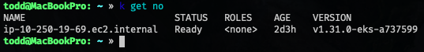

# BSC Analytics TacoCon 2024 Gameday

## AWS Credentials Setup and EKS Cluster Access

### Adding a New Profile to the AWS Credentials File

To add a new profile to your AWS credentials file:
* **Open**
```bash
vim ~/.aws/credentials
```
* **Append**
```bash
role_arn=arn:aws:iam::704855531002:role/BlueSentry
source_profile=bluesentrymfa
region=us-east-1
```

### AWS CLI Command to Connect to EKS Cluster

Once the profile is added, you can use the AWS CLI to connect to our EKS cluster:

```bash
aws eks update-kubeconfig --name dreamcanvas_dev --region us-east-1 --profile bscsandbox
```

Verify EKS Cluster Connectivity
After connecting to the EKS cluster, check if the connectivity is working by running the following command:

```bash
k get no
```

If the connection is successful, you should see a single node in the EKS cluster.



### Consuming the Kafka Topic

To consume messages from the correct Kafka topic:

* **Run Kafka CLI in cluster**

```bash
kubectl run <YOUR_TEAM_NAME> -n kafka --rm -i --tty --image=confluentinc/cp-kafka -- \
kafka-console-consumer --bootstrap-server kafka:9092 --topic gameday --from-beginning
```

This command runs a Kafka consumer in the kafka namespace to consume messages from the gameday topic starting from the beginning.


### Solve this problem

Use a ML model to find outliers in the following areas:

* Log level
* Response time
* Status Code

You can use a home-grown model or any cloud managed models.

* AWS Sagemaker
* Azure Anomaly Detector
* DBSCAN
* Google Vertex
* Any other

### Winners

You will be tested on accuracy and completeness of your model.

Winners will share their solution.