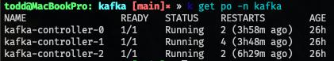
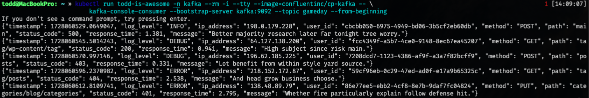
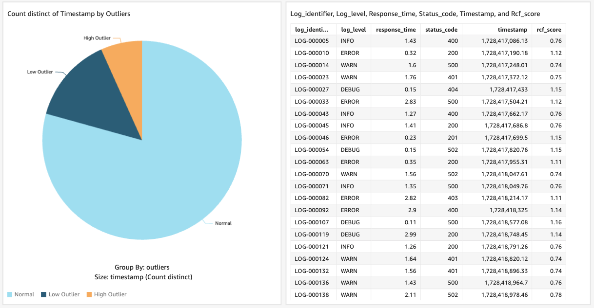

# BSC Analytics TacoCon 2024 Gameday

## AWS Credentials Setup and EKS Cluster Access

### Adding a New Profile to the AWS Credentials File

To add a new profile to your AWS credentials file:
* **Open**
```bash
vim ~/.aws/credentials
```
* **Append**
```bash
[eks-gameday]
aws_access_key_id = AK...
aws_secret_access_key = za...
```

### AWS CLI Command to Connect to EKS Cluster

Once the profile is added, you can use the AWS CLI to connect to our EKS cluster:

```bash
aws eks update-kubeconfig --name dreamcanvas_dev --region us-east-1 --profile eks-gameday
```

Verify EKS Cluster Connectivity
After connecting to the EKS cluster, check if the connectivity is working by running the following command:

```bash
k get po -n kafka
```

If the connection is successful, you should see a single node in the EKS cluster.



### Consuming the Kafka Topic

To consume messages from the correct Kafka topic:

* **Run Kafka CLI in cluster**

```bash
kubectl run <YOUR_TEAM_NAME> -l=kafka=consumer -n kafka --rm -i --tty --image=confluentinc/cp-kafka -- \
kafka-console-consumer --bootstrap-server kafka:9092 --topic gameday --from-beginning
```

This command runs a Kafka consumer in the kafka namespace to consume messages from the gameday topic starting from the beginning.



### Solve this problem

Use a ML model to find outliers in the following areas:

* Log level
* Response time

You can use a home-grown model or any cloud managed models.

* AWS Sagemaker
* Azure Anomaly Detector
* DBSCAN
* Google Vertex
* Any other

### What we did

1. **Get access to the stream locally**  
   Access the Kafka stream by consuming the logs from the `gameday` topic as described in the previous section.

2. **Find a way to clean and store logs**  
   Use appropriate tools or scripts to clean the logs, ensuring the data is structured and ready for analysis. You can store the logs in a temporary database or cloud storage (e.g., S3), depending on your team's setup.

3. **Train a model** (if necessary - we used RCF)  
   If your solution requires training a model, decide which ML model to use. We used **RCF (Random Cut Forest)**, but you can choose any model or cloud-based service. Ensure the model is trained on clean log data to detect outliers in log level and response time.

4. **Find a way to append that outlier score to the data** (if necessary)  
   After detecting outliers, append the outlier score to the logs for further analysis or reporting.

5. **Visualize the data and display outlier logs**  
   Visualize the outlier logs using a tool of your choice (e.g., Grafana, Kibana, or any cloud-native solution).


### Recommendation to Get with Your Team

- **Decide what cloud and solution**  
   Collaborate with your team to choose the cloud provider (AWS, Azure, Google) and solution approach that works best for you.

- **How you are building it**  
   Plan how you will develop and integrate the solution, from consuming logs to detecting outliers.

- **Confirm you all have access to that cloud sandbox**  
   Make sure everyone on your team has access to the necessary cloud resources and sandbox environments.

- **Build whatever you want ahead of time**  
   Prepare your solution components in advance, such as scripts, models, and visualizations, to streamline the process during the competition.

## Teams
| **Team 1**                    | **Team 2**                    | **Team 3**                     |
|--------------------------------|--------------------------------|---------------------------------|
| Ronda Lorraine Peoples         | Steffan Paul Williams          | Khane Mitchell                  |
| Mahmood Rahimi                 | Mahmood Rahimi                 | Kevin Robert Riste              |
| Gabriel Tizatto                | Gustavo Zanotto                | William H Ahlborn               |
| Robert Lee Douglas             | Patrick Agboola                | Mehmet Güngören                 |
| Caleb Cohen                    | Jaiver Lamar Hollingsworth     | Jean Pimmel                     |

| **Team 4**                    | **Team 5**                    | **Team 6**                     |
|--------------------------------|--------------------------------|---------------------------------|
| Cody James Schuyler            | Ashley Lauren Ellis            | Michael Scott Berrigan          |
| Michael Olivieri               | Dallin Rasmuson                | Jeremy K Elam                   |
| Andrew Deweeveer               | Thomas James Behnken           | Stephen Edward Opilo            |
| Mackenzie Sophia Graham        | Jon Ide                        | Nikita Usenko                   |
| Justin-Pedro Kelechi Nwosu     | John Pratt                     | Dastan M Rahimi                 |
|                                |                                | Bola                            |

| **Team 7**                    | **Team 8**         |
|--------------------------------|--------------------|
| Anthony Daniel Coccaro         | Alexis Perez       |
| J Robert Bullington            | David Van Ginneken |
| Christopher Mackubin           | Noor Alsabahi      |
| Beshr Alamir                   | Aric Hansen        |
| Brian Joseph Riste             | Ryan Young         |
| Nathan O’Connell               | Nolan Johnson      |
